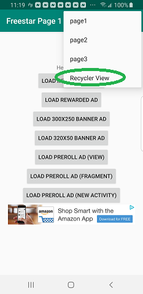

# Freestar Ads Mediation SDK Android Platforms

Please see <a href="https://github.com/freestarcapital/SDK_documentation_Android/wiki">our Wiki</a> for all of our Android related documentation: 

https://github.com/freestarcapital/SDK_documentation_Android/wiki

This repo is a native Android sample of Freestar Ads:

This is just one way to dynamically place ads in a RecyclerView based on a scroll listener approach.  Of course, you can come up with your own way.
Our RecyclerView implementation is <a href="https://github.com/freestarcapital/SDK_documentation_Android/tree/master/app/src/main/java/com/freestar/android/sample/recyclerview">here</a>.
